# Stitch CLI

These are the instructions for how to deploy a Facebook Bot via the Stitch CLI: https://docs.mongodb.com/stitch/import-export/stitch-cli-reference/index.html

## Setup

1. Make sure, if you haven't already, to clone the repo locally and then cd into the directory in your terminal.
2. Create a Facebook page if you don't have one already, https://www.facebook.com/pages/creation/
3. Create a Facebook app at https://developers.facebook.com 
4. On the Facebook app page, click "Setup" under messenger. 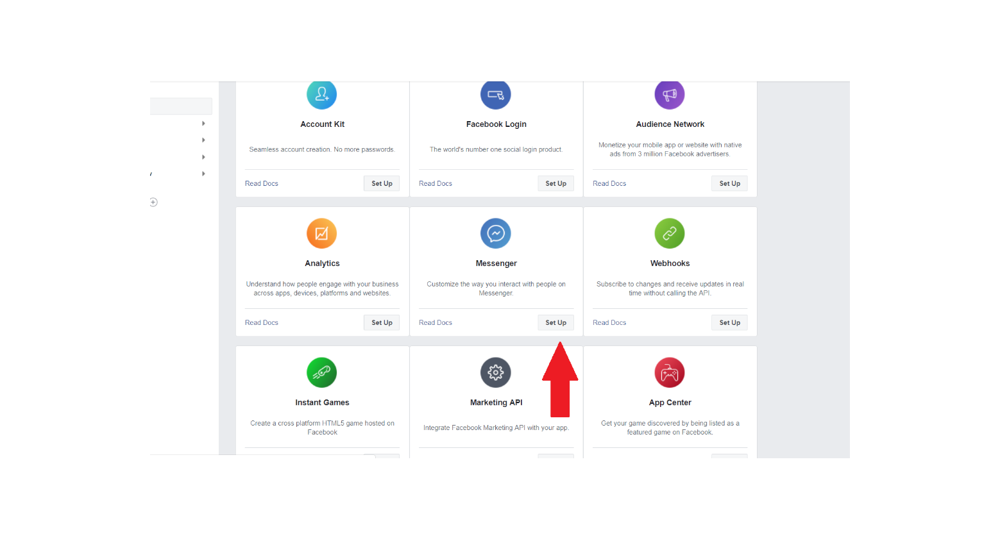 Then scroll down to Token Generation.  Select the Facebook page you would like to associate to this Facebook app, go through the confirmation process until you get the FB_PAGE_ACCESS_TOKEN.  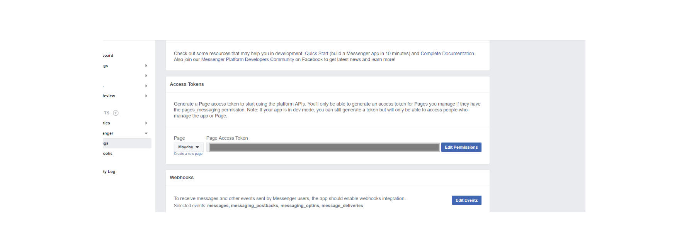
5. Make up a FB_VERIFICATION_BOT_TOKEN like '1234' just don't make it that easy.
6. Write down FB_PAGE_ACCESS_TOKEN and FB_VERIFICATION_BOT_TOKEN somewhere safe.

7. Create a new project on MongoDB with a cluster named "StitchFbStarter" if you don't have one already, https://cloud.mongodb.com.  It is recommended that you create your cluster in one of the supported Stitch regions since that should reduce some latency down the road https://www.mongodb.com/cloud/stitch/faq#where-available. 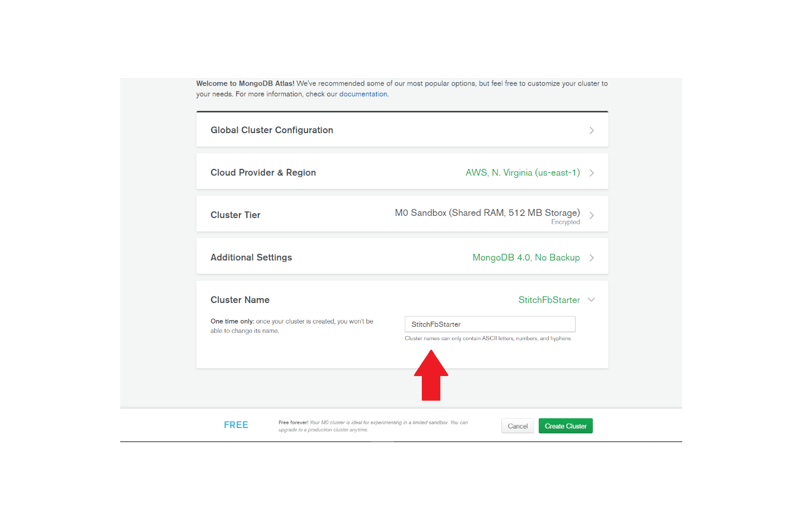

8. Make sure you are logged in using the stitch-cli and then import this stitch app.  For the most part you should be accepting the defaults within the cli with the one possible exception being the need to select the "Atlas Project Name" that holds the cluster you created earlier.

Log in: 
```
stitch-cli login --username=cloud.username@example.com --api-key=my-api-key
```
Import: 
```
stitch-cli import --path=./path/to/app/dir
```
9. Now when that is finished deploying go to the stitch app you just created in the web console, select services, then select the service you just created, and finally select the incoming webhook.  Go to settings for the function and copy the "Webhook URL" and place it somewhere safe for now. 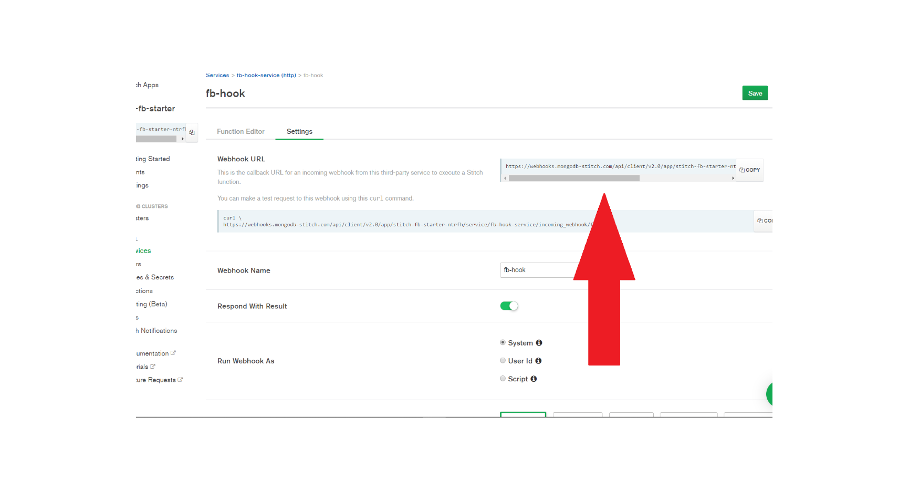
10. Click on "Values & Secrets" under Control for your Stitch App and then the "Secrets" tab.  Create two new secrets with your tokens from earlier:
* FB_PAGE_ACCESS_TOKEN
* FB_VERIFICATION_BOT_TOKEN (don't forget this is the one you make up)
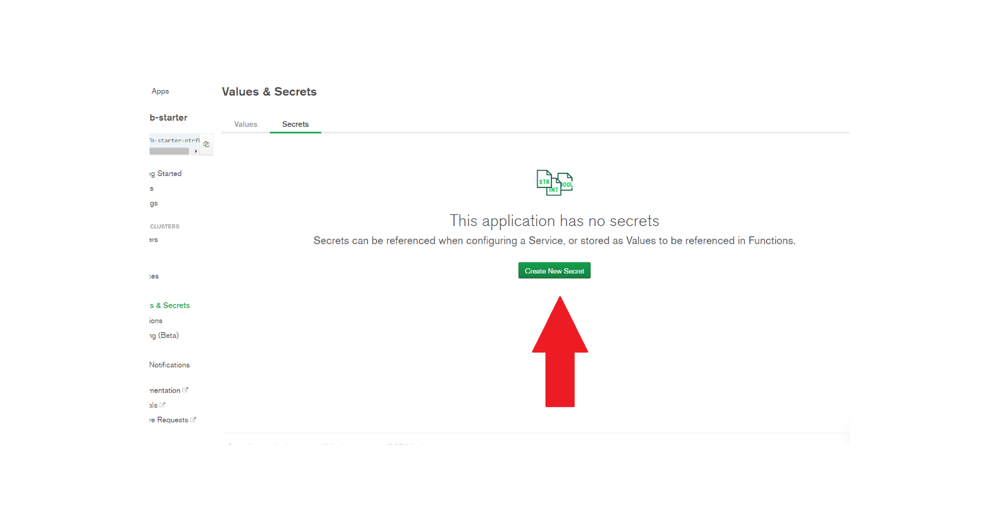
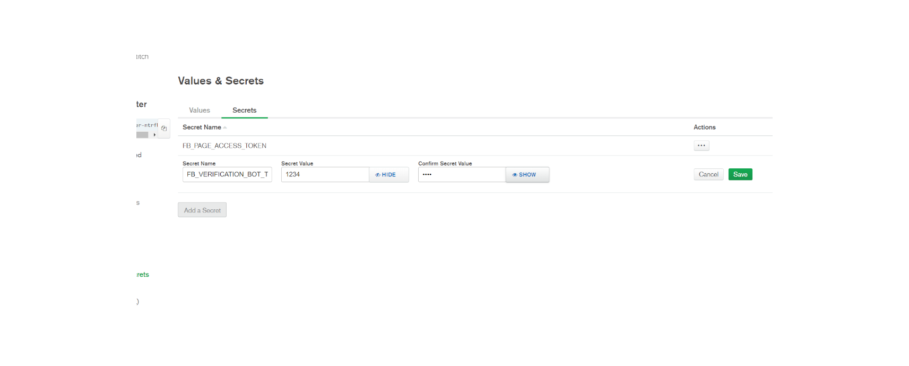
11. Return to the "Values" tab and add two values.  Each one has a "Value Type" as "Secret".  The FB_PAGE_ACCESS_TOKEN value should use FB_PAGE_ACCESS_TOKEN for its secret and FB_VERIFICATION_BOT_TOKEN should use FB_VERIFICATION_BOT_TOKEN.
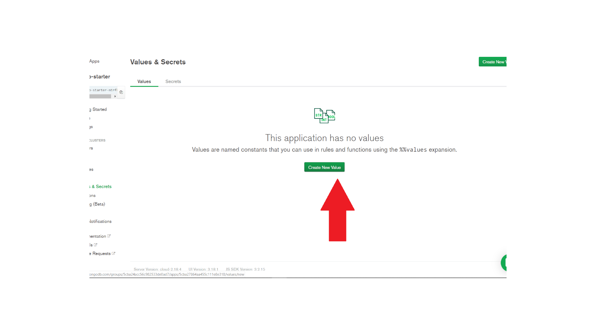
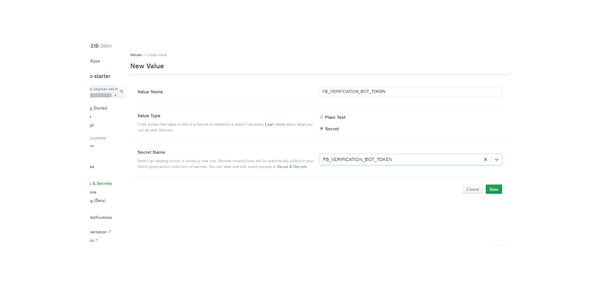

12. Return to the Facebook Developer Console and click on "Subscribe To Events" under Webhooks.
* Add the Webhook URL from Stitch to the Callback URL
* Add the FB_VERIFICATION_BOT_TOKEN you made up earlier to Verify Token.
* Check these boxes: messages, messaging_postbacks, messaging_optins, and message_deliveries
* Knock on wood and click "Verify and Save"
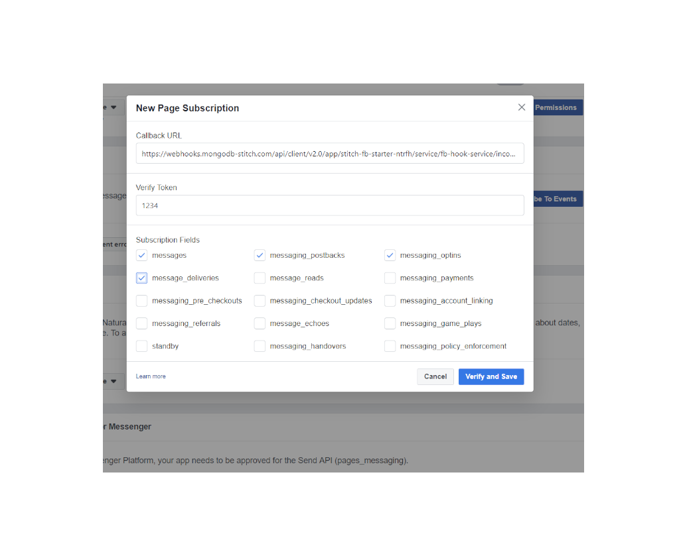
13. After the webhook is set on FB scroll down in the webhook section, select your FB page of choice, and hit "Subscribe".
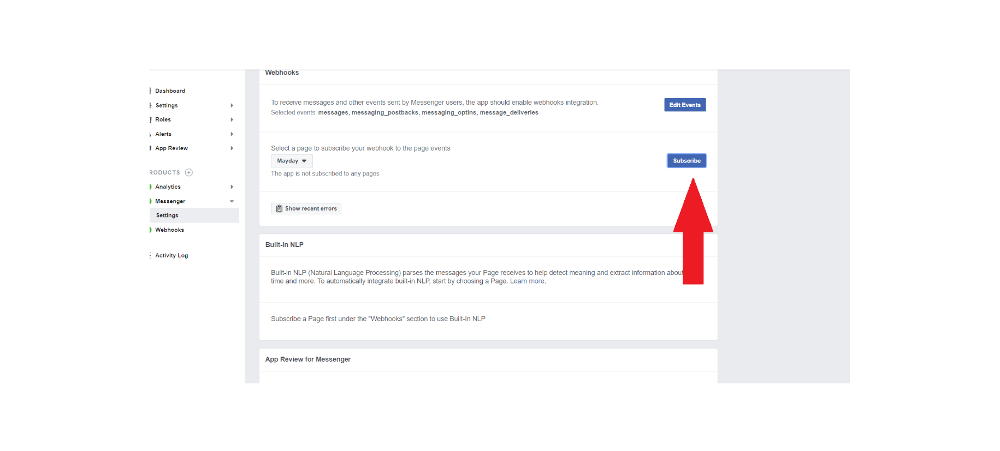

14. Now go back to the Settings for your Stitch Function, change the HTTP Method from GET to POST, and hit "Save".  GET messages are just used for subscribing to events on FB while POST actually does the heavy lifting.
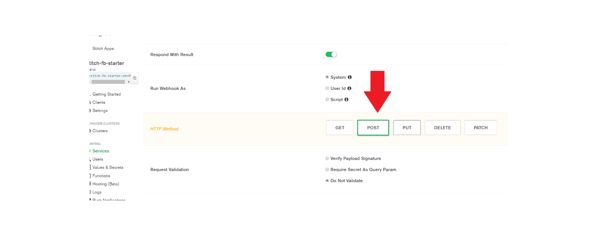

15. Congrats, you should have a MongoDB Stitch Function that is associated to your Facebook Page!!  You can either select "View as Page Visitor" on your Facebook Page and chat with your bot there 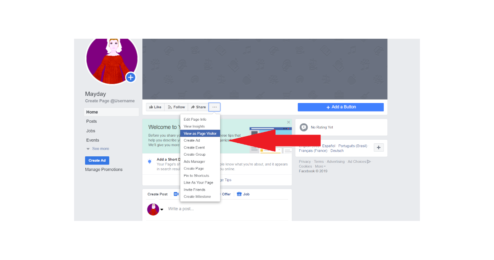 Alternatively you can go to https://www.messenger.com/t/<FB_PAGE_ID> and test your bot. 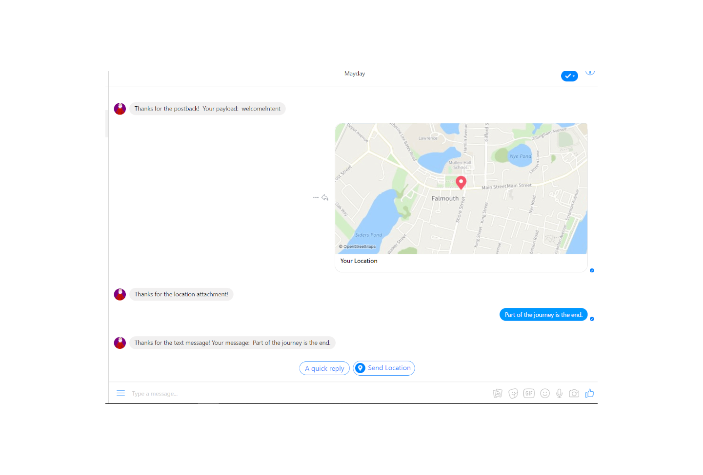

### P.S.
A few things changed with regards to "Values & Secrets" since I first wrote these instructions and you can no longer set them via the CLI hence why above you set those via the Stitch UI.  There is a way to do it via the Admin API but I just did got get a chance to try it.  Also it feels like the kobayashi maru of devops since you cannot set it without an appId but you do not get an appId until you deployed a Stitch App and the Stitch App will fail if the values set in the values folder are from a secret.

If you want to try to set the secrets via the Admin API, the code is below.

```
POST /groups/<groupId>/apps/<appId>/secrets

```