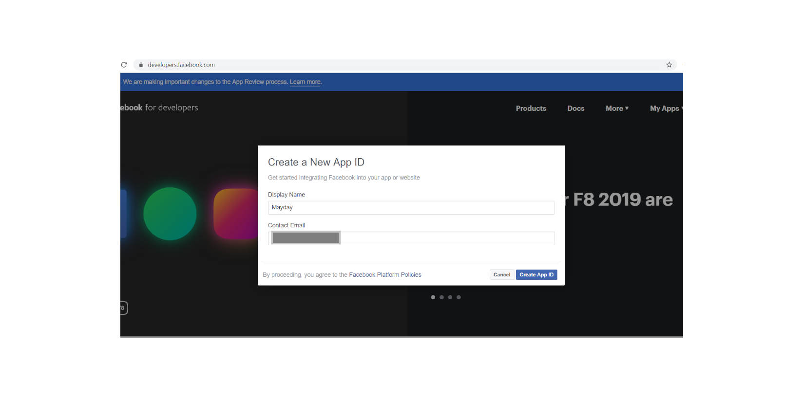
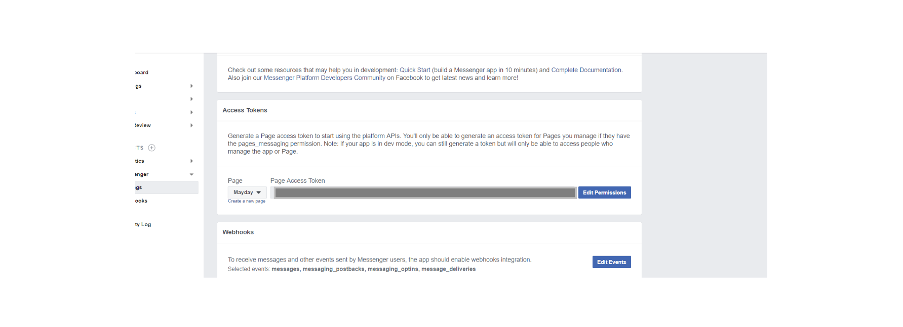
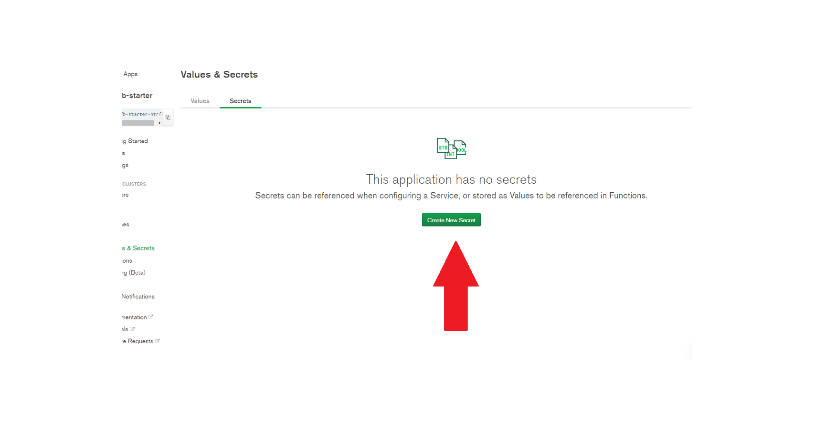
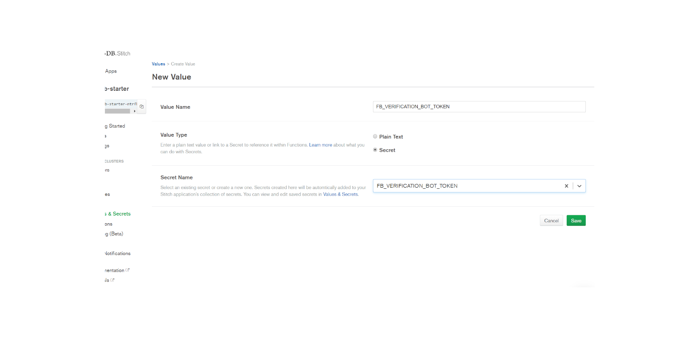
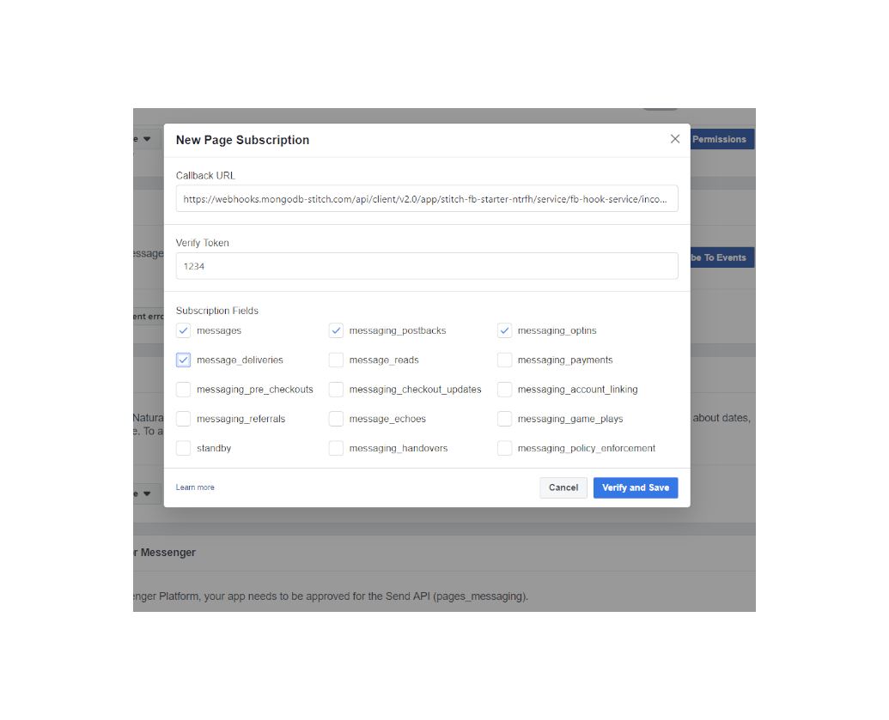
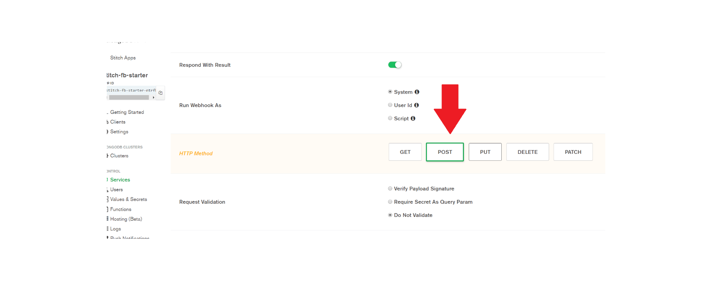
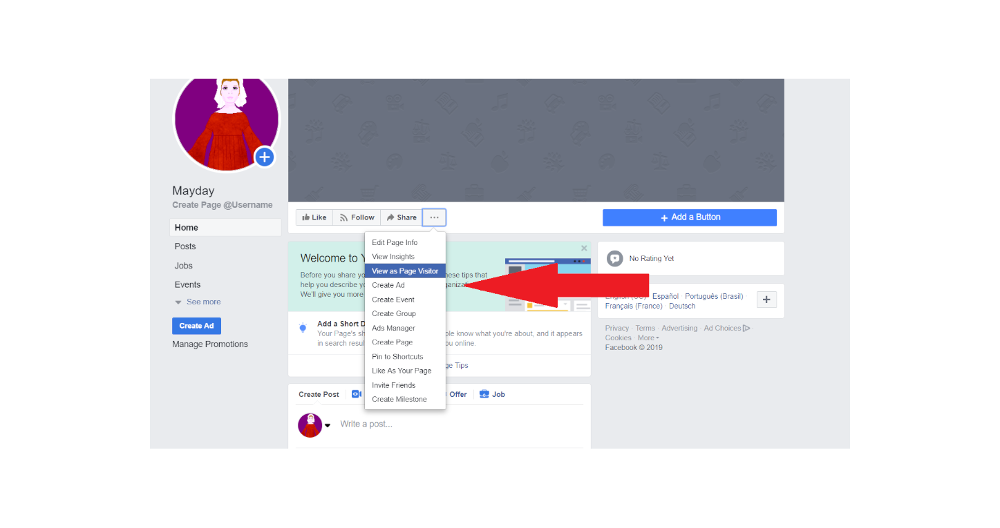
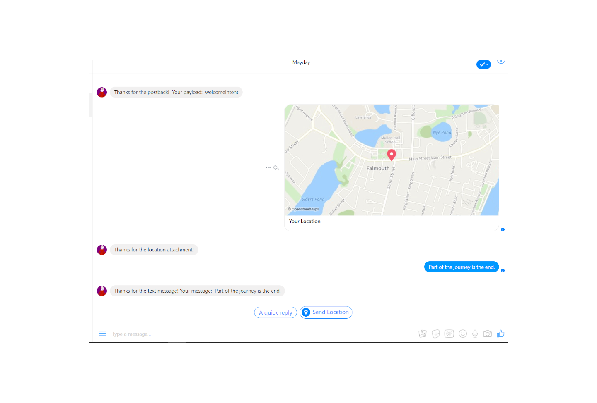

# Stitch UI

These are the instructions for how to deploy a Facebook Bot via the Stitch UI

## Setup Instructions

1. Create a Facebook page if you don't have one already, https://www.facebook.com/pages/creation/
2. Create a Facebook app at https://developers.facebook.com 
3. On the Facebook app page, click "Setup" under messenger.  Then scroll down to Token Generation.  Select the Facebook page you would like to associate to this Facebook app, go through the confirmation process until you get the FB_PAGE_ACCESS_TOKEN.  
4. Make up a FB_VERIFICATION_BOT_TOKEN like '1234' just don't make it that easy.
5. Write down FB_PAGE_ACCESS_TOKEN and FB_VERIFICATION_BOT_TOKEN somewhere safe.

6. Create a new project on MongoDB with a cluster named 'StitchFbStarter' if you don't have one already, https://cloud.mongodb.com.  It is recommended that you create your cluster in one of the supported Stitch regions since that should reduce some latency down the road https://www.mongodb.com/cloud/stitch/faq#where-available. 
7. Create a new Stitch App for your MongoDB project of choice.  I suggest changing the Stitch Service Name to something memorable so you can recognize it later.  
8. Click on Services under Control for your Stitch App and Add a Service.  Select "HTTP" service and name it "fb-hook-service". 
9. Click on the "Rules" tab for the service you just created, type in 'fbGraph' and then "Add Rule". 
Now select "POST" for the action, add the code below to the "When" section, and hit "Save".
```
{
  "%%args.url.host": {
    "%in": [
      "graph.facebook.com"
    ]
  }
}
```

10. Go to the "Incoming Webhooks" tab and select "Add Incoming Webhook". 
For the new incoming webhook, select: 
* Whatever name you would like
* Respond with result should be changed to positive
* Run Webhook As System
* HTTP Method is GET
* Do Not Validate for the Request Validation.
* And hit "Save".

11. Copy over the code for you FB function which is likely the [services/fb-hook-service/incoming_webhooks/fb-hook/source.js](services/fb-hook-service/incoming_webhooks/fb-hook/source.js) file.  Hit "Save".

12. Go back to the Settings for the Function and copy the "Webhook URL". Place this somewhere safe for now. 
13. Click on "Values & Secrets" under Control for your Stitch App and then the "Secrets" tab.  Create new secrets with your tokens from earlier:
* FB_PAGE_ACCESS_TOKEN
* FB_VERIFICATION_BOT_TOKEN (don't forget this is the one you make up)


14. Return to the "Values" tab and add two values.  Each one has a "Value Type" as "Secret".  The FB_PAGE_ACCESS_TOKEN value should use FB_PAGE_ACCESS_TOKEN for its secret and FB_VERIFICATION_BOT_TOKEN should use FB_VERIFICATION_BOT_TOKEN.



15. Return to the Facebook Developer Console and click on "Subscribe To Events" under Webhooks.
* Add the Webhook URL from Stitch to the Callback URL
* Add the FB_VERIFICATION_BOT_TOKEN you made up earlier to Verify Token.
* Check these boxes: messages, messaging_postbacks, messaging_optins, and message_deliveries
* Knock on wood and click "Verify and Save"

16. After the webhook is set on FB scroll down in the webhook section, select your FB page of choice, and hit "Subscribe".


17. Now go back to the Settings for your Stitch Function, change the HTTP Method from GET to POST, and hit "Save".  GET messages are just used for subscribing to events on FB while POST actually does the heavy lifting.


18. Congrats, you should have a MongoDB Stitch Function that is associated to your Facebook Page!!  You can either select "View as Page Visitor" on your Facebook Page and chat with your bot there  Alternatively you can go to https://www.messenger.com/t/<FB_PAGE_ID> and test your bot. 